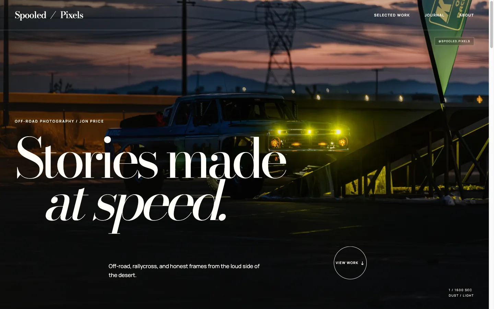
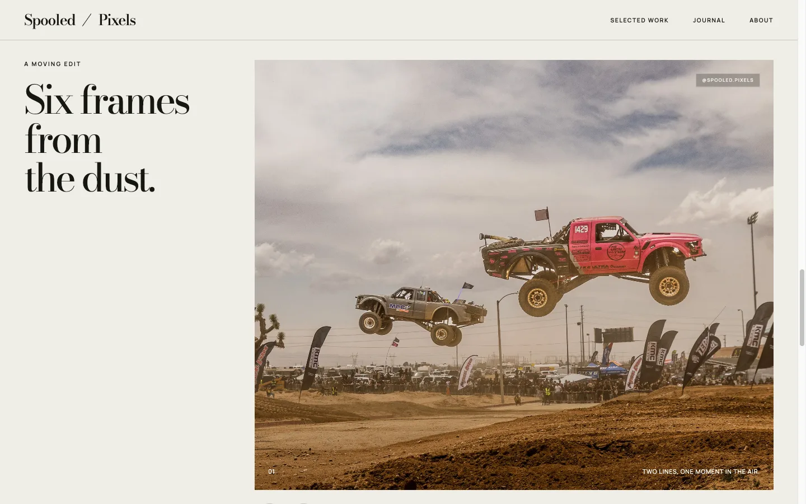
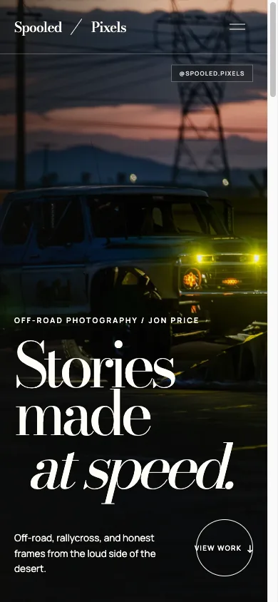
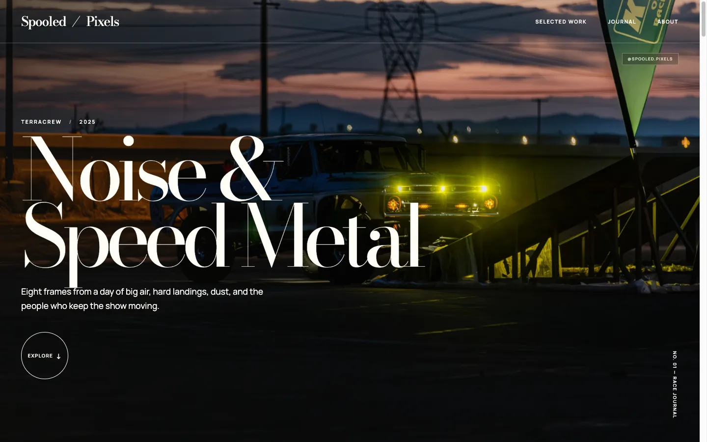
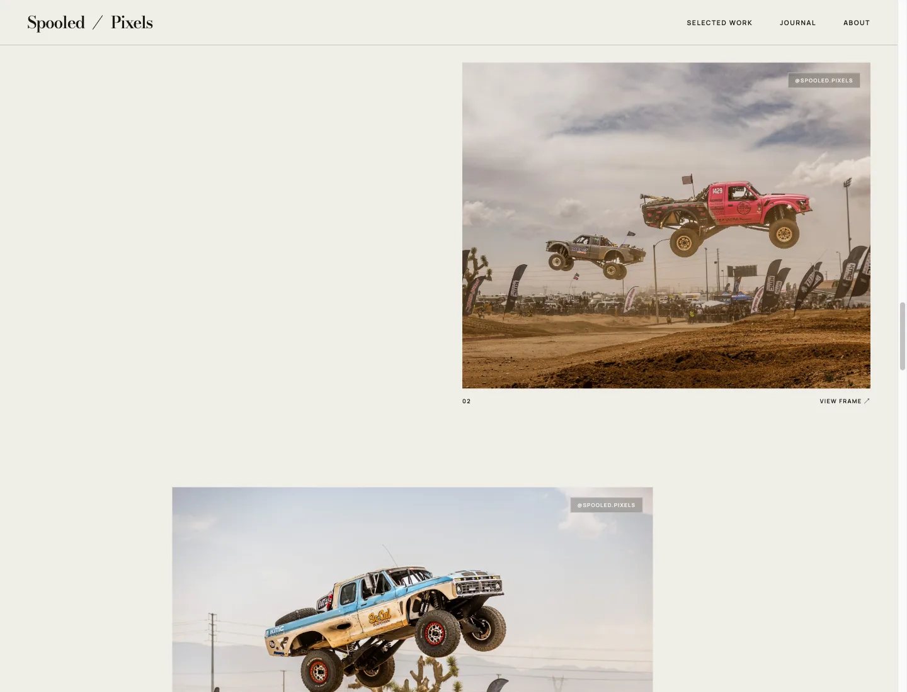
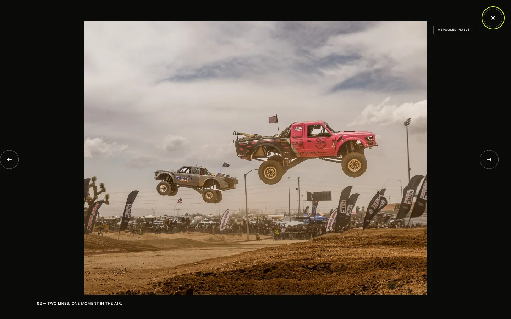
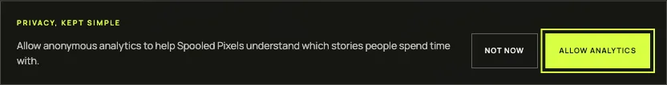

# Spooled Pixels

An editorial automotive photography portfolio built with Jekyll. The site includes a real eight-frame off-road album, responsive galleries, safe-area-aware mobile layouts, keyboard and swipe controls, a full-screen lightbox, privacy-first optional GA4 tracking, and subtle `@spooled.pixels` image branding.



## Preview the site

The repository includes a Docker-backed Jekyll workflow:

```bash
make serve
```

Open `http://127.0.0.1:4000`. Run `make build` to create a production-ready copy under `_site`.

The home page pairs a full-bleed hero with a featured carousel that responds to arrow keys and touch swipes:



On narrow screens the header collapses to a menu button and the hero respects the device safe area:



## Edit the album

Album copy, captions, and image paths live in [`_data/albums.yml`](./_data/albums.yml). Web-ready photographs are stored under [`assets/images/speed-metal`](./assets/images/speed-metal); each full-resolution image has a `-960.webp` mobile derivative selected through `srcset`. Source photographs remain outside this repository.

```yaml
albums:
  - slug: noise-and-speed-metal
    title: Noise & Speed Metal
    location: TerraCrew
    year: "2025"
    cover: /assets/images/speed-metal/01-dusk-lights.webp
    cover_mobile: /assets/images/speed-metal/01-dusk-lights-960.webp
    cover_alt: An off-road race truck glowing under green lights at dusk
    dek: Eight frames from a day of big air, hard landings, dust, and the people who keep the show moving.
    photos:
      - src: /assets/images/speed-metal/02-tandem-flight.webp
        mobile_src: /assets/images/speed-metal/02-tandem-flight-960.webp
        alt: Two off-road race trucks airborne over the TerraCrew course
        caption: Two lines, one moment in the air.
        author: Jon Price
```

`title`, `location`, `year`, and `dek` render the album masthead:



Each entry under `photos` becomes one frame in the staggered gallery, numbered in order with its caption:



Selecting a frame opens the lightbox. Arrow keys and the on-screen controls move between photographs; `Esc`, the close button, or a click on the backdrop dismisses it and returns focus to the frame you opened.



The featured album page is generated from [`albums/noise-and-speed-metal/index.md`](./albums/noise-and-speed-metal/index.md) and rendered by [`_layouts/album.html`](./_layouts/album.html). A new album needs a matching `slug` in `_data/albums.yml` and a page whose front matter sets `layout: album` and `album_slug`.

The visible watermark is a reversible CSS overlay. It does not modify the underlying image file.

## Google Analytics

Analytics is disabled until `google_analytics_id` is set in [`_config.yml`](./_config.yml). Consent is required by default, and the Google script is not loaded before a visitor opts in.

```yaml
google_analytics_id: "G-XXXXXXXXXX"
google_analytics_require_consent: true
```

With consent required, first-time visitors get this prompt, and nothing is sent to Google until they choose:



Setting `google_analytics_require_consent: false` loads GA4 immediately and removes the prompt. See [`docs/analytics.md`](./docs/analytics.md) for setup, tracked events, privacy behavior, and production validation.

## Checks

```bash
pnpm test
make verify-local
make verify-analytics
```
